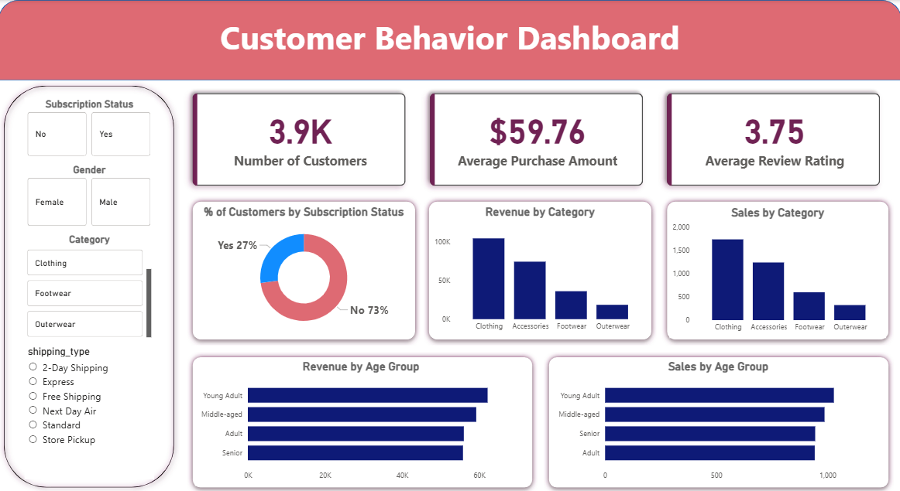
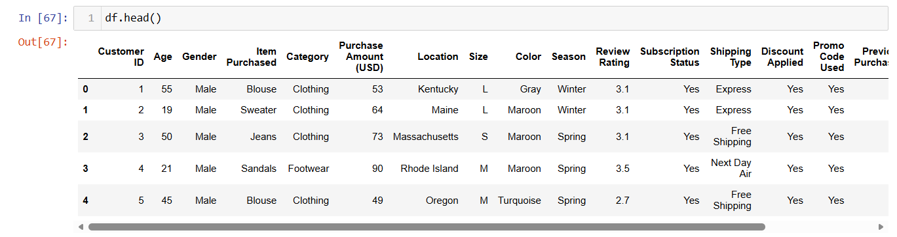
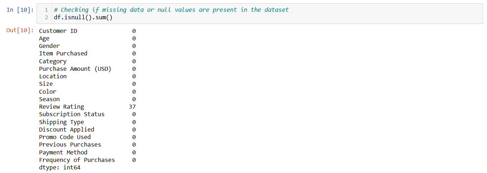
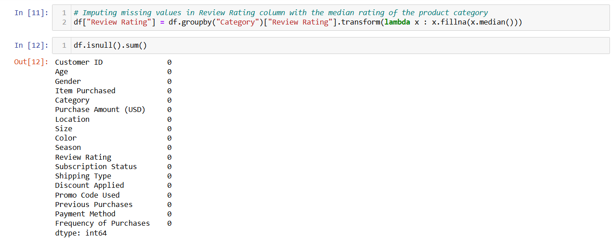
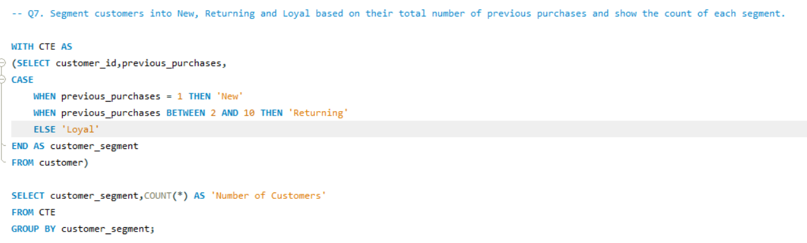
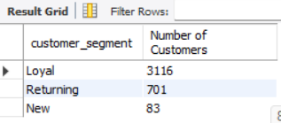

# 📊 Customer Shopping Behavior Analysis using Python, SQL & Power BI

## 🔍 Overview

This project analyzes 3,900+ customer transactions to uncover purchasing patterns, customer segments, and revenue insights. It follows an end-to-end data analytics workflow using Python, MySQL, and Power BI to generate actionable business insights.

## 📁 Dataset

1. ~3,900 records with 18 features
2. Includes:
	- Demographics (Age, Gender, Location, Subscription Status)
	- Purchase details (Product, Category, Amount, Season)
	- Behavior metrics (Discount usage, Frequency, Ratings, Shipping 	  type)

## 🛠️ Tools & Technologies

- Python (Pandas, NumPy, Matplotlib, Seaborn) – Data cleaning & EDA
- MySQL – Business query analysis
- Power BI – Interactive dashboard
- Gamma – Presentation creation

## ⚙️ Project Steps

1. Data Loading
	- Imported dataset using Pandas
2. Data Cleaning & Preparation
	- Handled missing values
	- Standardized column names
	- Performed feature engineering
3. Exploratory Data Analysis (EDA)
	- Analyzed distributions, trends, and relationships
	- Identified key patterns in customer behavior
4. SQL Analysis (MySQL)
	- Wrote queries to solve business problems
	- Performed revenue, segmentation, and product analysis
5. Dashboard Creation
	- Built interactive visualizations in Power BI
6. Reporting & Presentation
	- Documented insights in a report
	- Created presentation using Gamma

## 📊 Dashboard Preview

The Power BI dashboard provides insights on:

-  Revenue distribution
-  Customer segments
-  Product performance
-  Purchase behavior trends

## 📈 Key Insights

- Loyal customers contribute the highest revenue
- Discounts increase purchase frequency but reduce average order value
- Certain product categories dominate sales across all age groups
- Subscribers show higher repeat purchase behavior

## 🧠 Skills Demonstrated

- Data Cleaning & Preprocessing  
- Exploratory Data Analysis (EDA)  
- SQL Query Writing  
- Data Visualization  
- Business Insight Generation  

## 💡 Business Impact

- Helps businesses target high-value customers
- Improves marketing strategies using segmentation
- Supports data-driven discount and pricing decisions

## 🖼️ Additional Analysis

  ## 🐍 Python EDA
  

  ## 🧹 Data Cleaning
 
 

  ## 🗄️ SQL Analysis
 
 

## 🚀 How to Run
- Clone the repository
- Open the Python notebook and run EDA steps
- Load cleaned data into MySQL
- Execute SQL queries for analysis
- Open Power BI file to explore dashboard

## 📂 Project Structure

├── data/
├── notebooks/
├── sql/
├── screenshots/
├── dashboard/
├── report/
├── presentation/
└── README.md

## ✨ Future Improvements
- Add predictive modeling (Machine Learning)
- Automate data pipeline
- Deploy dashboard online

